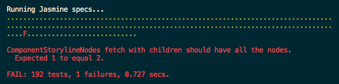

# Jasmine Headless WebKit
## Run your Jasmine specs at sonic boom speed!

[Jasmine](http://pivotal.github.com/jasmine/) is great. I love it. But running Jasmine when you need to test code that will run
in a browser environment can be problematic and slow:

* The [Jasmine gem](https://github.com/pivotal/jasmine-gem)'s server makes getting up and testing very fast, but F5-ing your browser for each test run is distracting.
* Jasmine CI uses Selenium, which speeds up the process a bit, but you're still rendering pixels in a browser, albeit with the option of rendering those pixels in a lot of different browsers at once.
* Node.js, EnvJS, and Rhino solutions for running Jasmine are great for anything that will never run in a real browser. I'm a big believer of running code destined for a browser in a browser itself, not a simulator.
* [Evergreen](https://github.com/jnicklas/evergreen) makes Jasmine testing in a Rails app as easy as pie, but not everyone writes for Rails.

But there's a solution for fast, accurate browser-based testing. with a focus on continuous testing,
using one of the most popular browser cores, and that dovetails perfectly into the Jasmine gem's already established protocols.

## Enter `jasmine-headless-webkit`

`jasmine-headless-webkit` uses the [QtWebKit widget](http://trac.webkit.org/wiki/QtWebKit) to run your specs without needing to render a pixel. It's nearly
as fast as running in a JavaScript engine like Node.js, and, since it's a real browser environment, all the modules
you would normally use, like jQuery and Backbone.js, work without any modifications. If you write your tests correctly,
they'll even work when running in the Jasmine gem's server with no changes to your code.

`jasmine-headless-webkit` also streamlines your workflow in other ways:

* It integrates with [Guard](https://github.com/guard/guard) for a continuous testing setup when using [`guard-jasmine-headless-webkit`](https://github.com/guard/guard-jasmine-headless-webkit).
* It compiles [CoffeeScript](http://jashkenas.github.com/coffee-script/), both for your tests and for your application logic.
* It can be configured like RSpec, and its output is very similar to RSpec's output, so you don't need to learn too much new stuff to use and integrate it.
* It's *fast*.

## Is this for me?

That depends on what you need:

* If you're new to JavaScript testing, drop in [Pivotal's Jasmine gem](https://github.com/pivotal/jasmine-gem) and point your browser at http://localhost:8888/.
* If you're used to how the Jasmine gem works and want to move to a faster solution geared toward continuous testing, you're in the right place!
* If you want an even simpler config and access to all of your Rails routes and resources for a quasi-intergration testing setup, use [Evergreen](https://github.com/jnicklas/evergreen).
  You even get your choice of browser drivers for free (as opposed to just Selenium or WebKit) as well as headless testing!
* If you want true integration testing, where you test the whole application stack, use Cucumber and/or Capybara.
* If you're not using Rails and still want to unit test, the Jasmine gem or `jasmine-headless-webkit` is what you want.

'round here, we focus on unit testing and mocking external interfaces. No using your app's views or routes, no hitting the app server to
get resources, just mocking and stubbing.

## How do I use this wonderful toy?

You can use it standalone:

    gem install jasmine-headless-webkit

Or you can use it with Bundler:

    gem 'jasmine-headless-webkit'

However you install it, you'll get a `jasmine-headless-webkit` executable. You'll also need to set up your project
to use the Jasmine gem:

    gem install jasmine
    jasmine init

Once you're good enough, you can make the `spec/javascripts/support/jasmine.yml` file yourself and skip the Pivotal Jasmine gem entirely.
It's what the cool kids do.

### What do I need to get it working?

Installation requires Qt 4.7. `jasmine-headless-webkit` has been tested in the following environments:

* Mac OS X 10.6 and 10.7, with MacPorts Qt, Homebrew Qt and Nokia Qt.mpkg
* Kubuntu 10.10 and 10.04
* Ubuntu 11.04 9.10
* Arch Linux

If it works in yours, [leave me a message on GitHub](https://github.com/johnbintz) or
[fork this site](https://github.com/johnbintz/jasmine-headless-webkit/tree/gh-pages) and add your setup.

## Qt 4.7.X

The gem is compiled using **qt4-qmake** and you will need Qt 4.7.x or greater.
The version you have installed should be detected correctly, and the appropriate message for installing Qt should
be given if it's wrong. If it's not, please file a new issue!

### Manually checking the Qt version

Test that qt4-qmake it is installed and verify your version.
     qmake --version

If you have the Qt 4.7.x or greater, you are ready to install jasmine-headless-webkit.
     QMake version 2.01a
     Using Qt version 4.7.2 in /usr/lib

If you receive a different message, you can install qt4-qmake using one of the following commands as root:

### Ubuntu 11.04


sudo apt-get install libqt4-dev
sudo apt-get install qt4-qmake


### Ubuntu 9.10

Running `sudo apt-get install libqt4-dev` and `sudo apt-get install qt4-qmake` will install qt4,
but it installs **version 4.5.2**, which will not be able to compile 
**jasmine-headless-webkit**, as it requires Qt 4.7.X or greater.

You will need to compile qt4-qmake from source
[Qt version 4.7.0](http://get.qt.nokia.com/qt/source/qt-everywhere-opensource-src-4.7.0.tar.gz).
There are excellent [directions](http://doc.qt.nokia.com/latest/install-x11.html) on how to compile
the source code. You will need to ensure Qt is exported to your $PATH before using qmake, as the source code will
install to /usr/local/Trolltech/.

### Mac OS X 10.6 & 10.7

#### MacPorts


sudo port install qt4-mac


#### Homebrew


brew install qt


__(you may need to use `--build-from-source` on Lion)__

### My OS isn't on here!
[`capybara-webkit`](https://github.com/thoughtbot/capybara-webkit) has the best instructions for installing Qt on various other
systems that may not be covered here.

### How does it work?

`jasmine-headless-webkit` generates a static HTML file that includes the Jasmine JavaScript library from the Jasmine
gem, your application and spec files, and any helpers you may need. The runner then creates a WebKit widget that
loads the HTML file, runs the tests, and grabs the results of the test to show back to you. Awesome!

`jasmine-headless-webkit` uses the same `jasmine.yml` file that the Jasmine gem uses to define where particular
files for the testing process are located:


src_files:
  - public/assets/common.js
  - public/assets/templates.js
  - public/javascripts/models/**/*.js
  - public/javascripts/collections/**/*.js
  - public/javascripts/views/**/*.js
  - app/coffeescripts/models/**/*.coffee
  - app/coffeescripts/collections/**/*.coffee
  - app/coffeescripts/views/**/*.coffee
helpers:
  - helpers/**/*.{js,coffee}
spec_files:
  - "**/*[Ss]pec.{js,coffee}"
src_dir:
spec_dir: spec/javascripts


It also brings in the same copy of the Jasmine library that the Jasmine gem includes, so if you're testing in both environments,
you're guaranteed to get the same results in your tests.

#### Caching, caching, caching

`jasmine-headless-webkit` does two things that are CPU intensive (besides running tests): compiling CoffeeScript and analyzing
spec files to get line number information for nicer spec failure messages (_did I mention you get really nice spec failure
messages with `jasmine-headless-webkit`, too?_). These two operations are cached into the `.jhw-cache/` folder from where the
runner is executed. When this cache is combined with running tests continuously using Guard, runtime overhead is reduced to almost
nothing.

Of course, being a cache, it takes time to warm up. The first time you run `jasmine-headless-webkit` on a big project, it can take
several seconds to warm the cache. After that, enjoy an almost 20% speedup in runtime (tested on exactly one project's runtime,
YMMV). This is new as of `0.7.0`.

#### `*.coffee` in my `jasmine.yml` file?!

Yes, `jasmine-headless-webkit` will support `*.coffee` files in `jasmine.yml`, which the normal Jasmine server currently
does not support out of the box. Once there's official support, you'll be able to easily switch between `jasmine-headless-webkit`
and the Jasmine test server when you're using CoffeeScript. CoffeeScript files are compiled and injected into the generated HTML
files.

Never done Jasmine in CoffeeScript? It looks like this:


describe 'Component', ->
  describe 'StorylineNode', ->
    model = null

    beforeEach ->
      model = new ComponentStorylineNode({id: 1})

    it 'should not be new', ->
      expect(model.isNew()).toEqual(false)


...and it turns into this...


describe('Component', function() {
  return describe('StorylineNode', function() {
    var model;
    model = null;
    beforeEach(function() {
      return model = new ComponentStorylineNode({
        id: 1
      });
    });
    return it('should not be new', function() {
      return expect(model.isNew()).toEqual(false);
    });
  });
});


#### Server interaction

Since there's no Jasmine server running, there's no way to grab test files from the filesystem via Ajax.
If you need to test server interaction, do one of the following:

* Stub your server responses using [Sinon.JS](http://sinonjs.org/), the recommended way.
* Use [PhantomJS](http://www.phantomjs.org/) against a running copy of a Jasmine server, instead of this project.

#### What else works?

`alert()` and `confirm()` work, though the latter always returns `true`. You should be mocking calls to `confirm()`,
of course:


spyOn(window, 'confirm').andReturn(false)


`console.log()` also works.  It uses `JSON.stringify()` to serialize objects. This means that cyclical objects, like HTML elements, can't be directly serialized (yet). Use jQuery to help you retrieve the HTML:


console.log($('#element').parent().html())


If you need a heavy-weight object printer, you also have `console.pp()`, which uses Jasmine's built-in pretty-printer if available, and falls back to `JSON.stringify()` if it's not. This one's the best for
printing HTML nodes, but it can be pretty noisy when printing objects.

## Running the runner


jasmine-headless-webkit [ -c / --colors ]
                        [ --no-colors ]
                        [ --no-full-run ]
                        [ --keep ]
                        [ -l / --list ]
                        [ --report <report file> ]
                        [ -j / --jasmine-config <path to jasmine.yml> ]
                        <spec files to run>


The runner will return one of three exit codes:

* __0__ means your tests passed sucessfully.
* __1__ means you had a failure in your tests.
* __2__ means your tests passed, but you used `console.log()` somewhere.

### Setting default options

Much like RSpec, you can define the default options for each run of the runner. Place your global options into a
`~/.jasmine-headless-webkit` file and your per-project settings in a `.jasmine-headless-webkit` file at the root of
the project.

### Listng what files `jasmine-headless-webkit` will include

If your tests are not picking up a file you thought they should be, or they're being included in the wrong order,
run with the `-l` flag to get a list of the files that `jasmine-headless-webkit` will include in the generated HTML file.

### Coloring the output

`jasmine-headless-webkit` will not color output by default. This makes it easier to integrate with CI servers. If you want
colored output, use the `-c` flag. With colored output, your tests will look like this:

If you have colors turned on globally, you can turn them off per-project or per-run with `--no-colors`.

### Preserving compiled output on errors

CoffeeScript logic errors can be hard to track down. Keep the generated HTML files with the `--keep` flag and you'll
get `specrunner.$$.html` files in your working directory.

### Writing out a machine-readable report

Use the `--report` option to create a detailed report file:

    PASS||Statement||One||file.js:23
    FAIL||Statement||Two||file.js:23
    CONSOLE||Yes
    ERROR||Uh oh||file.js:23
    TOTAL||1||2||3||T

[`guard-jasmine-headless-webkit`](http://github.com/guard/guard-jasmine-headless-webkit/) uses this for the Growl notifications.
You can also use it in your own setups, to run specs remotely and stick the results into a CI system. You can use
`Jasmine::Headless::Report` to interpret the file and transform the output.

### Using a different `jasmine.yml` file

If for some reason you're not using the default path for a `jasmine.yml` file (which is `spec/javascripts/support/jasmine.yml`),
you can provide that path with `-j`.

### Running only certain spec files

By default, if no files are passed into `jasmine-headless-webkit`, all possible spec files in the `spec_files` definition
will be run. You can limit the run to only certain files by passing those to `jasmine-headless-webkit`:


jasmine-headless-webkit spec/javascripts/models/node_viewer.coffee


#### Filtered runs and full runs

Typically, targeted spec running is done by a tool like Guard, and the order of running goes like this:

* Run the filtered spec
  * If it fails, stop processing and alert the user
  * If it succeeds, run all specs and alert on success or failure

Having your test running tool re-run `jasmine-headless-webkit` is fast, but there's still the cost of instantiating QtWebKit and Ruby
with each run. Versions of `jasmine-headless-webkit` 0.3.0 and greater will do this for you, keeping the widget in memory and running
Jasmine tests on first the filtered suite, and then the complete suite. The results you'll get are for the last run that's executed, which
is typically what you want to know anyway. Newer versions of `guard-jasmine-headless-webkit` also support this behavior. This trims
valuable seconds off of testing with every run, saving you enough time every day to run to the coffee shop and get some delicious brew!

If you don't want this behavior, pass in `--no-full-run` and filtered runs will be the only thing that runs when you request one.

## Running the runner from a Ruby program

You can call the runner from Ruby:


require 'jasmine-headless-webkit'

status_code = Jasmine::Headless::Runner.run(
  :colors => false, 
    #=> true to get colors
  :remove_html_file => true, 
    #=> false to keep specrunners on failure
  :jasmine_config => 'spec/javascripts/support/jasmine.yml',
    #=> run a different config
  :report => false, 
    #=> filename if a report file should be written
  :full_run => true, 
    #=> false to not run a full run after a targeted run
  :files => ['file_one_spec.js', 'file_two_spec.coffee']
    #=> files to use for a targeted run, [] to run all
)


## Automated testing during development

`jasmine-headless-webkit` works best when it's running all the time, re-running tests when you update the appropriate files.
If you use [Guard](https://github.com/guard/guard/), install [`guard-jasmine-headless-webkit`](http://github.com/guard/guard-jasmine-headless-webkit/)
and run `guard init jasmine-headless-webkit` to add the necessary bits to your `Guardfile` to test a Rails 3.1 (or a well-structured Rails 3.0) app.

### Rails 3.1 and the Asset Pipeline

Since your JS code can now flow through the Rails 3.1 asset pipeline, and since it's not easy for non-Rails apps to get access to that pipeline,
testing your pipelined code in Rails 3.1 is a bit more difficult. The best way is to regenrate your code with each change and then run
`jasmine-headless-webkit` on the code, and now, there's a Guard for that! [`guard-rails-assets`](http://github.com/dnagir/guard-rails-assets) will watch
your app's code for changes and rebuild your pipelined JS code, ready to be tested with `jasmine-headless-webkit`:


guard 'rails-assets' do
  watch(%r{^app/assets/javascripts/(.*)\.(js|coffee)$})
end

guard 'jasmine-headless-webkit' do
  watch(%r{^public/assets/.*\.js$})
  watch(%r{^spec/javascripts/.*\.coffee$})
end


### Jammit for JS templates

If you like to use Jammit to shove together your JS templates into one file, you can use a Guard for that, too! [`guard-jammit`](http://github.com/guard/guard-jammit)
provides Jammit watching support, but the current version (as of 2011-06-18) does not support some changes to Jammit's internals. Use [my fork](http://github.com/johnbintz/guard-jammit)
until that gets fixed.


guard 'jammit' do
  watch(%r{^app/views/.*\.jst$$})
end

guard 'jasmine-headless-webkit' do
  watch(%r{^public/assets/.*\.js$})
  watch(%r{^spec/javascripts/.*\.coffee$})
end


### Autotest

Support for Autotest is *deprecated* and no new features will be added to the Autotest runners unless provided by other users.

## Rake tasks

You can create a Rake task for your headless Jasmine specs:


require 'jasmine-headless-webkit'

Jasmine::Headless::Task.new('jasmine:headless') do |t|
  t.colors = true
  t.keep_on_error = true
  t.jasmine_config = 'this/is/the/path.yml'
end


If you've bundled `jasmine-headless-webkit` in with Rails, you'll also get a basic task for running your
Jasmine specs. Be sure to include the gem in the development group so you get with a normal call to `rake -T`:


group :test, :development do
  gem 'jasmine-headless-webkit'
end


<pre>
# rake -T

rake jasmine:headless     # Run Jasmine specs headlessly
</pre>

This is the same as running `jasmine-headless-webkit -c`.

## Continuous Integration Using Xvfb

Since most continuous integration servers do not have a display, you will need to use
Xvfb or virtual framebuffer Xserver for Version 11. If you elect not to use Xvfb, you will
need to have a browser and graphical display to run `jasmine-headless-webkit -c`.

Reference: [Xvfb Manpages](http://manpages.ubuntu.com/manpages/natty/man1/Xvfb.1.html)

### Install Xvfb
      sudo apt-get install xvfb

### Resolve Missing Dependencies
To resolve missing dependencies, you will need to know what to install.
	$ Xvfb :99 -ac
You will see a long list of warning messages:

     [dix] Could not init font path element /usr/share/fonts/X11/misc,
     removing from list!
     [dix] Could not init font path element /usr/share/fonts/X11/cyrillic,
     removing from list!
     [dix] Could not init font path element 
     /usr/share/fonts/X11/100dpi/:unscaled, removing from list!
     [dix] Could not init font path element
      /usr/share/fonts/X11/75dpi/:unscaled, removing from list!
     [dix] Could not init font path element 
     /usr/share/fonts/X11/Type1, removing from list!
     [dix] Could not init font path element 
     /usr/share/fonts/X11/100dpi, removing from list!
     [dix] Could not init font path element 
     /usr/share/fonts/X11/75dpi, removing from list!
     sh: /usr/bin/xkbcomp: not found
     (EE) Error compiling keymap (server-42)
     (EE) XKB: Couldn't compile keymap
     [config/dbus] couldn't take over org.x.config:
     org.freedesktop.DBus.Error.AccessDenied 
     (Connection ":1.74" is not allowed to
     own the service "org.x.config.display99" 
     due to security policies in the configuration file)	

Installing the following packages would resolve the above warning messages. Your
missing packages may be different depending on the packages you have installed.
     sudo apt-get install x11-xkb-utils
     sudo apt-get install xfonts-100dpi xfonts-75dpi 
     sudo apt-get install xfonts-scalable xfonts-cyrillic
     sudo apt-get install xserver-xorg-core

Once you have resolved these dependencies, you should see:
     [dix] Could not init font path element /usr/share/fonts/X11/misc,
     removing from list!
     [dix] Could not init font path element /usr/share/fonts/X11/cyrillic,
     removing from list!
     [dix] Could not init font path element 
     /usr/share/fonts/X11/100dpi/:unscaled, removing from list!
     [dix] Could not init font path element
      /usr/share/fonts/X11/75dpi/:unscaled, removing from list!
     [dix] Could not init font path element 
     /usr/share/fonts/X11/Type1, removing from list!
     [dix] Could not init font path element 
     /usr/share/fonts/X11/100dpi, removing from list!
     [dix] Could not init font path element 
     /usr/share/fonts/X11/75dpi, removing from list!

### Run with Xvfb
Use Xvfb to run the headless rake command. This will resolve the issue of jasmine-webkit-specrunner failing to connect
to X server.
     xvfb-run rake jasmine:headless 
     xvfb-run jasmine-headless-webkit -c

Reference: [MARTIN DALE LYNESS](http://blog.martin-lyness.com/archives/installing-xvfb-on-ubuntu-9-10-karmic-koala)

## RubyMine

RubyMine may throw an error when running rake spec, you will need to provide a
JavaScript runtime environment.

     rake aborted!
     Could not find a JavaScript runtime.
     See https://github.com/sstephenson/execjs
     for a list of available runtimes.

To resolve this problem, install the **therubyracer** gem, which is the embed V8 JavaScript interpreter into Ruby.
Reference: [therubyracer](https://github.com/cowboyd/therubyracer)

You can use it standalone:

    gem install therubyracer

Or you can use it with Bundler:

    gem 'therubyracer'

## I have a problem or helpful suggestion, good sir.

Here's what you can do:

* Leave a ticket on [the Issues tracker](https://github.com/johnbintz/jasmine-headless-webkit/issues).
* [Fork'n'fix the code](https://github.com/johnbintz/jasmine-headless-webkit). Feel free to add a bunch of tests, too. I cowboyed this project when starting it, and I'm slowly getting back to being a good boy.
* Ping me on [Twitter](http://twitter.com/johnbintz) or on [GitHub](https://github.com/johnbintz).

## Credits & License

* Copyright (c) 2011 John Bintz
* Original Qt WebKit runner Copyright (c) 2010 Sencha Inc.
* Jasmine JavaScript library Copyright (c) 2008-2011 Pivotal Labs

Permission is hereby granted, free of charge, to any person obtaining a copy
of this software and associated documentation files (the "Software"), to deal
in the Software without restriction, including without limitation the rights
to use, copy, modify, merge, publish, distribute, sublicense, and/or sell
copies of the Software, and to permit persons to whom the Software is
furnished to do so, subject to the following conditions:

The above copyright notice and this permission notice shall be included in
all copies or substantial portions of the Software.

THE SOFTWARE IS PROVIDED "AS IS", WITHOUT WARRANTY OF ANY KIND, EXPRESS OR
IMPLIED, INCLUDING BUT NOT LIMITED TO THE WARRANTIES OF MERCHANTABILITY,
FITNESS FOR A PARTICULAR PURPOSE AND NONINFRINGEMENT. IN NO EVENT SHALL THE
AUTHORS OR COPYRIGHT HOLDERS BE LIABLE FOR ANY CLAIM, DAMAGES OR OTHER
LIABILITY, WHETHER IN AN ACTION OF CONTRACT, TORT OR OTHERWISE, ARISING FROM,
OUT OF OR IN CONNECTION WITH THE SOFTWARE OR THE USE OR OTHER DEALINGS IN
THE SOFTWARE.

